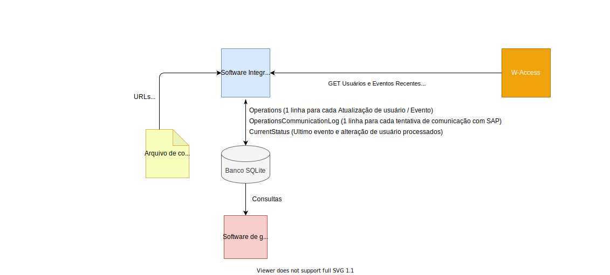

# Integração Recintos Galeão

---
### Código de Licença W-Access
2961

---
## Informações pré-vendas

### Objetivo
Fazer o cadastramento e registro de acesso de usuários que acessam os recintos alfandegários para a receita federal.
Informações não são enviadas diretamente para a receita, mas para sistema SAP interno, que por sua vez faz a comunicação com a receita.

### Origem dos dados
W-Access, API

### Destino dos dados
Endpoints SAP, HTTP

### Dados relevantes para a integração
- Usuários visitantes atualizados recentemente
- Eventos de acesso em leitoras selecionadas

### Integração precisa manter dados próprios? Quais
Sim. Histórico e situação de cada chamada feita no SAP.

### É necessário controle de erro / re-envio? Descrição
Sim. Caso a operação de envio para o SAP falhe, ela deve ser repetida até obter sucesso.

### Existe ambiente para homologação / testes?
Sim, para os dados de origem e para o destino também.

### Pode ser usado o W-Access mais novo?
Sim

### É possível simular ambiente em bancada?
Sim

### Contatos
- Integrador: Leandro Abreu <leandro.abreu@wellcare.com.br>
- Cliente: Marcelo Pupe <marcelopupe@riogaleao.com>

---

## Informações sobre a implementação

### Modo de execução
Periódico via agendamento do Windows. Sugestão de execução a cada 5 minutos.

### Modo e itens de instalação
Instalação Manual.
Cópia dos arquivos e criação do agendamento.

### Versão do W-Access usada no desenvolvimento. Original ou com patches?
W-Access 4.205.1

### Versão do W-Access mais recente em que a integração está funcionando
W-Access 4.205.1

### Descrição do controle de erro / dados da integração
Banco de dados sqlite mantém dados enviados e situação de cada operação. Cada execução da integração verifica se há dados pendentes de envio.

### Descrição do fluxo de execução

### De / para de campos com observações de formato

#### Para todos os usuários
Campo destino|Campo origem| Descrição textual do formato e/ou exemplo ilustrativo (apenas se precisar de re-formatação)
| --- |---| --- |
"nome"|"FirstName"|
"data_nascimento"|"AuxDte01"|"2010-01-01"

#### Específicos por tipo
Campo destino|Campo origem| Descrição textual do formato e/ou exemplo ilustrativo (apenas se precisar de re-formatação)
| --- |---| --- |
"nome"|"FirstName"|
"data_nascimento"|"AuxDte01"|"2010-01-01"

---

## Informações de acesso ao cliente e equipamentos
- **Teamviewer** - Leandro Abreu (Wellcare): **1 535 399 133** / Senha padrão
Usuário, senha, VPN, Acesso remoto ()

---

## Histórico da integração
- 2021-07-01 - Versão final rodando em homologação
